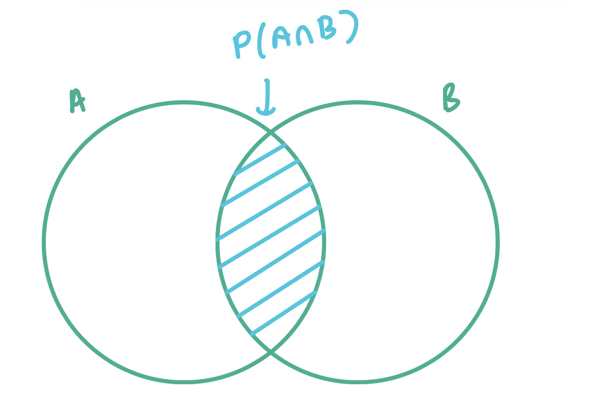

Today I was reading about [Base Rate Fallacy](https://jonathanweisberg.org/vip/chbayes.html#baserate) on _Odds & Ends_ by Jonathan Weisberg, which is a textbook for introductory philosophy courses on probability and inductive logic, freely available on his website [here](https://jonathanweisberg.org/vip/). The chapter also starts off with this quote, 

> …in no other branch of mathematics is it so easy for experts to blunder as in probability theory.
> —Martin Gardner 

It resonates as I have been learning statistics for almost the better half of my life, and yet there are still so many concepts and things that challenge my understanding of it. The chapter got me wondering how do I represent conditional probability on a Venn diagram, which I've never done before. 

We all (should, I hope!) know how to find joint probability of set A and set B, P(A\cap B), which is the intersection of the two, if the events are not independent. $P(A\cap B)$ \\(P(A\cap B)\\) $$P(A\cap B)$$ \[P(A\cap B)\] \\[P(A\cap B)\\]

We know that conditional probability is P(A|B) = P(A\cap B)P(B). To depict P(A|B), the sample space is now 

where we are interested in the joint probability over set B.

This is where base rate fallacy comes in, where Jonathan describes with the taxicab and Zika virus problem. If Joe tests positive to a blood test on Zika virus, what is the probability he really has the virus? 

The test has a true positive rate P(P | Z) of 0.95, and a true negative rate \\$P(NP | NZ)\\$ of 0.85. 

Turns out, Joe only has about 6% chance of having the virus. This is because the base rate of having the virus in population is only 1%. And we were after \(P(Z | P)\), which is Joe having the virus, given he tested positive. 

Had the base rate of the virus in the population be 30%, the chances of Joe having the virus given he's tested positive goes up to 73%! 